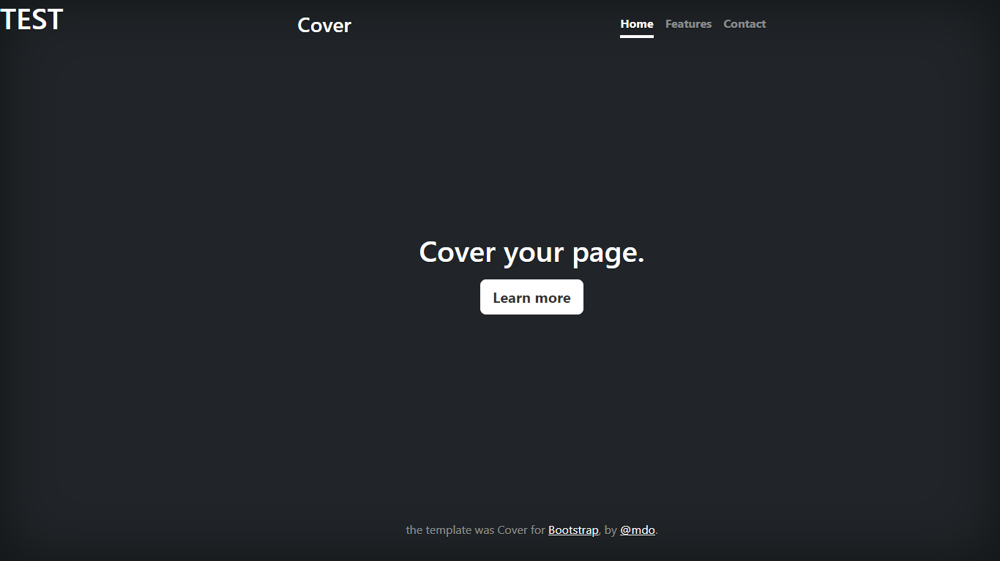
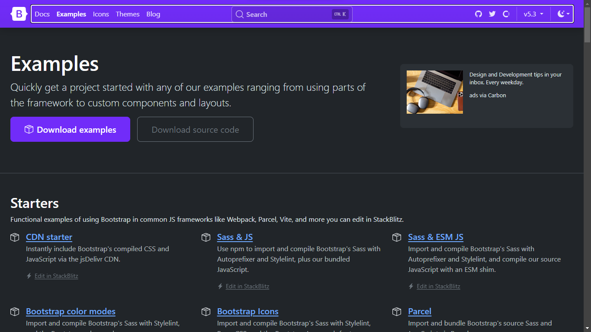
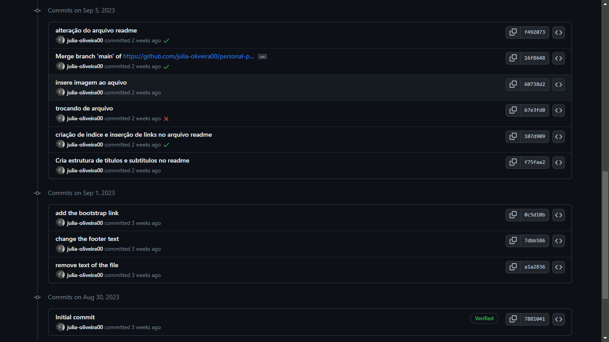

# índice

* [Projeto de portifólio pessoal](#personal-portfolio)  
* [Descrição](#descri%C3%A7%C3%A3o)  
* [Introdução](#introdu%C3%A7%C3%A3o)  
* [Funcionalidades](#funcionalidades)  
* [Tecnologias utilizadas](#tecnologias-utilizadas)  
* [Fontes consultadas](#fontes-consultadas)  
* [Autores](#autores)  

# personal-portfolio

Projeto criado utilizando exemplo do Bootstrap para ensino de uso do README e do Bootstrap.

## Descrição

Neste projeto aprendemos a usar elementos do README enquanto linguagem de marcação, organização e aprofundamento em commit, além do uso e implementação de Bootstrap.

## Introdução
A começar pelo uso de Bootstrap.

**********

Após dowload e implementação nós fizemos auterações no código para aprender o devido uso do commit, que mensagens usar, para que usar e como usar, ainda, tivemos uma simulação do uso de commit para ponte entre computadores.

***********
Enquanto na documentação aprendemos organização, hierarquia de textos, inserção de links, imagens, gifs e videos. 

A principio criamos o indice do README.
E então seu corpo, com o objetivo de ser o mais autodidata e proativo possivel.
## Funcionalidades

### Tecnologias utilizadas

Utilizamos vscode e github em sua maioria para aplicação de HTML5, CSS3 e Bootstrap.

## Fontes consultadas

Conhecimentos aprendidos em aula através do professor Leonardo:
https://github.com/leonardossrocha

Site oficial do github:
https://docs.github.com/pt/account-and-profile/setting-up-and-managing-your-github-profile/customizing-your-profile/managing-your-profile-readme
